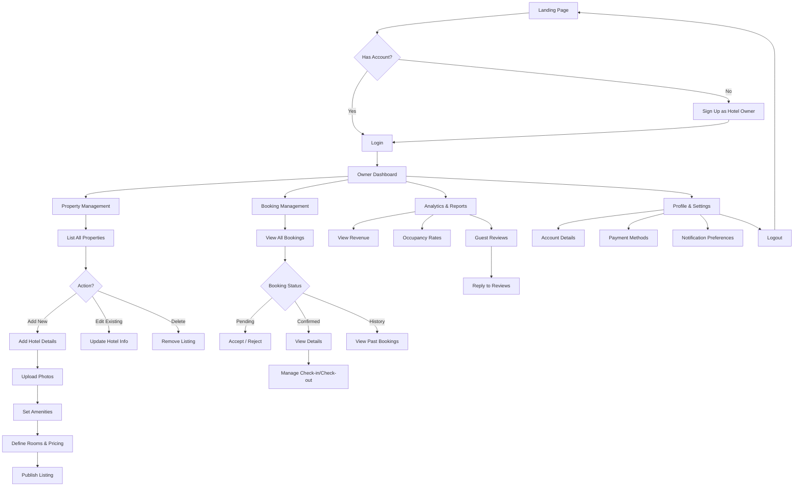

# Hotel Owner Flowchart

This flowchart outlines the user journey for a Hotel Owner managing their properties and bookings on the platform.

## Key Modules

1.  **Authentication**: Secure login/signup specifically for property owners.
2.  **Dashboard**: Central hub for all management activities.
3.  **Property Management**: CRUD operations for hotels and rooms.
4.  **Booking Management**: Handling reservations and guest status.
5.  **Analytics**: Insights into business performance.

## Flow Description

1.  **Registration & Onboarding**:
    *   Potential owners sign up specifically as "Hotel Owners".
    *   They undergo a verification process (optional/simulated).
    *   Once verified, they access the **Owner Dashboard**.

2.  **Dashboard Overview**:
    *   The landing page for owners.
    *   Shows quick stats: Active Bookings, Total Revenue, Occupancy Rate.
    *   Provides quick links to "Add Property" or "View Bookings".

3.  **Property Management**:
    *   **Add New**: Owners input hotel details (Name, Location, Description), upload high-quality images, and define amenities.
    *   **Room Setup**: Define room types (Single, Double, Suite), prices per night, and available quantity.
    *   **Edit/Update**: Owners can update pricing or availability in real-time.

4.  **Booking Handling**:
    *   Owners receive notifications for new bookings.
    *   **Pending**: Review guest details and special requests.
    *   **Action**: Accept or Reject the booking (if manual approval is set) or view auto-confirmed bookings.
    *   **Check-in/Out**: Update status when guests arrive or leave.

5.  **Analytics & Insights**:
    *   Visual graphs showing earnings over time.
    *   Review feedback from guests and reply to reviews to maintain reputation.
