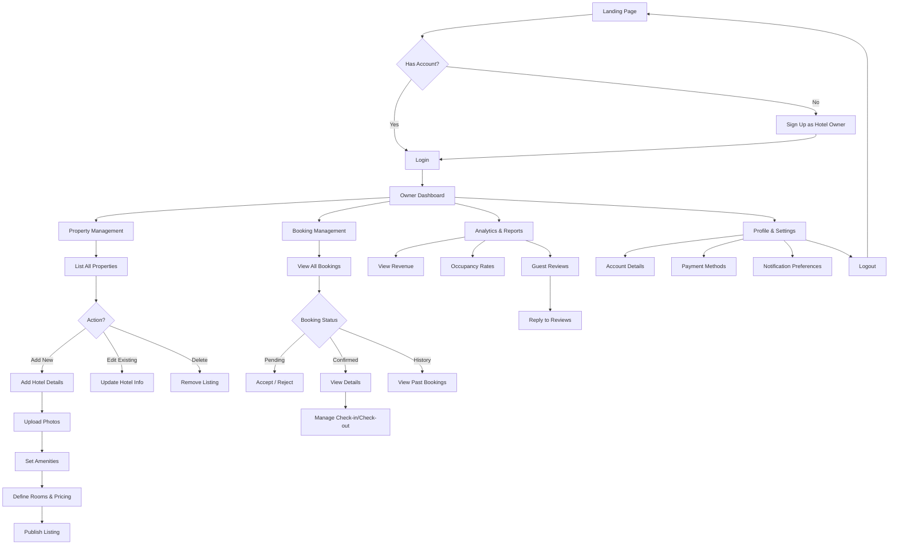

# Hotel Booking Application Documentation

## 📖 Project Overview
This is a modern, responsive Hotel Booking web application designed for the Nepali market. It allows users to browse hotels, view details, make bookings, and navigate using interactive maps. The application features an AI-powered assistant to help users find the perfect stay.

## 🛠️ Technology Stack
- **Frontend Framework**: React 19
- **Build Tool**: Vite 7
- **Styling**: Tailwind CSS 4 (Utility-first CSS)
- **Routing**: React Router DOM 7
- **Maps**: Leaflet & React-Leaflet (OpenStreetMap)
- **Animations**: GSAP (GreenSock Animation Platform)
- **Icons**: Lucide React
- **AI Integration**: Mistral AI SDK

## 📂 Project Structure
```
frontend/
├── src/
│   ├── components/
│   │   ├── layout/       # Navbar, Footer
│   │   ├── ui/           # Reusable UI components (Buttons, Cards, AI Assistant)
│   │   └── utils/        # Helper components (ScrollToTop)
│   ├── data/             # Static data files (hotels.js)
│   ├── pages/            # Main page components
│   │   ├── LandingPage.jsx
│   │   ├── HotelDetailsPage.jsx
│   │   ├── BookingPage.jsx
│   │   ├── MapPage.jsx
│   │   └── ...
│   ├── App.jsx           # Main application component with Routing
│   └── main.jsx          # Entry point
├── public/               # Static assets
├── .env                  # Environment variables
└── package.json          # Dependencies and scripts
```

## 🌟 Key Features

### 1. User Interface & Experience
- **Responsive Design**: Fully responsive layout using Tailwind CSS.
- **Animations**: Smooth page transitions and element animations using GSAP.
- **Preloader**: A custom preloader animation that greets users before redirecting to the login page.

### 2. Navigation & Routing (`App.jsx`)
- **Public Routes**: Landing, Search, Hotel Details, About, Services, Contact.
- **Protected Routes**: Booking and Dashboard pages require authentication.
- **Authentication**: Simple `localStorage` based authentication flow (`/login`, `/signup`).

### 3. Hotel Management
- **Browsing**: Users can view a list of hotels with images, ratings, and prices.
- **Details**: Detailed view for each hotel including amenities, location, and reviews.
- **Search**: Functionality to filter and find hotels.

### 4. Map Integration
- **Interactive Maps**: Uses Leaflet to display hotel locations on OpenStreetMap.
- **Routing**: Shows routes from user location to the hotel.
- **Geocoding**: Converts addresses to coordinates for map placement.

### 5. AI Assistant
- **Smart Chatbot**: Integrated Mistral AI assistant to answer user queries.
- **Recommendations**: Provides personalized hotel recommendations based on user preferences.
- **Fallback**: Works with local logic if the AI API is unavailable.

## 🚀 Getting Started

### Prerequisites
- Node.js (v18 or higher recommended)
- npm (Node Package Manager)

### Installation
1. Navigate to the frontend directory:
   ```bash
   cd frontend
   ```
2. Install dependencies:
   ```bash
   npm install
   ```

### Configuration
1. Create a `.env` file in the `frontend` directory.
2. Add your Mistral AI API key (optional, for AI features):
   ```env
   VITE_MISTRAL_API_KEY=your_api_key_here
   ```

### Running the Application
Start the development server:
```bash
npm run dev
```
The application will be available at `http://localhost:5173`.

### Building for Production
To build the application for deployment:
```bash
npm run build
```
To preview the production build locally:
```bash
npm run preview
```

## 🔒 Authentication Flow
- The app uses a simulated authentication system.
- `localStorage.setItem('isAuthenticated', 'true')` is used to log users in.
- Protected routes check this value and redirect to `/login` if not set.

## 🧩 Component Highlights
- **Layout**: Wraps pages with `Navbar` and `Footer`.
- **AIAssistant**: A floating chat widget available on most pages.
- **ScrollToTop**: Automatically scrolls to the top of the page on route change.

## 📊 Hotel Owner Flowchart

The following flowchart outlines the user journey for a Hotel Owner managing their properties and bookings.



