# Project Report

## CHAPTER TWO: LITERATURE REVIEW

### 2.1 Introduction
Chapter 2 presents a detailed review of hotel booking systems relevant to Roomora, a hotel booking platform designed specifically for Nepal. This chapter explores similar existing systems, their features, algorithms, and technologies, and highlights the uniqueness of Roomora in comparison.

**Figure 2.1: Literature Framework**
*(Figure 2.1 shows the key contents discussed in this chapter, including features, algorithms, technologies, system comparisons, and Roomora's proposed framework.)*

```mermaid
graph TD
    %% Main Node
    LR((Literature Review))

    %% Branches
    LR --> Feat[Features of Roomora]
    LR --> Algo[Algorithms Used]
    LR --> Tech[Technology Stack]
    LR --> Comp[System Comparisons]
    LR --> Frame[Proposed Framework]

    %% Features Sub-nodes
    Feat --> F1[User Signup & Login]
    Feat --> F2[Search & Filtering]
    Feat --> F3[Recommendations]
    Feat --> F4[Map Integration]
    Feat --> F5[Chatbot]
    Feat --> F6[Owner Dashboard]

    %% Algorithms Sub-nodes
    Algo --> A1[Hotel Recommendation]
    Algo --> A2[Preference Matching]

    %% Technology Sub-nodes
    Tech --> T1[MERN Stack]
    Tech --> T2[OpenStreetMap]
    Tech --> T3[MongoDB]

    %% Comparison Sub-nodes
    Comp --> C1[Booking.com]
    Comp --> C2[Agoda]
    Comp --> C3[TripAdvisor]
    Comp --> C4[MakeMyTrip]

    %% Framework Sub-nodes
    Frame --> Fr1[Traveler Ecosystem]
    Frame --> Fr2[Hotel Management]
    
    %% Styling
    classDef main fill:#2563eb,stroke:#1d4ed8,stroke-width:2px,color:white;
    classDef sub fill:#dbeafe,stroke:#3b82f6,stroke-width:1px,color:#1e3a8a;
    class LR main;
    class Feat,Algo,Tech,Comp,Frame sub;
```

### 2.2 Features of Roomora
Roomora offers a combination of traveler-focused and hotel management features, making it unique in the Nepalese context. Key features include:
*   **User Signup & Login** – Users can create profiles and log in to access personalized services.
*   **Hotel Search & Filtering** – Allows users to filter hotels by location, price, rating, amenities, and availability.
*   **Recommendation Suggestions** – Recommends hotels using preference-based algorithms.
*   **Map Integration** – Displays hotel locations and nearby facilities on OpenStreetMap.
*   **Booking & Payment** – Enables secure room booking and management.
*   **Interactive Chatbot** – Provides guidance, answers queries, and assists in bookings.
*   **Hotel Management Dashboard** – Helps hotel owners track bookings, manage room availability, and monitor customer preferences.

### 2.3 Algorithms Used in Roomora
**Hotel Recommendation Algorithm**
Roomora uses a multi-criteria recommendation algorithm to suggest hotels based on preferences and previous interactions.

### 2.4 Technology Used
1.  **MERN Stack** – For modern full-stack development, combining frontend and backend in a single ecosystem.
2.  **OpenStreetMap** – Integrated mapping solution to show hotel locations and nearby amenities.
3.  **Chatbot Framework** – Interactive assistant for user support.
4.  **MongoDB Database** – Stores hotel details, user profiles, reviews, and booking information.

### 2.5 Comparison Systems
To understand Roomora’s positioning, we compare it with major hotel booking platforms:

1.  **Booking.com**
    *   Provides extensive hotel listings worldwide, with filtering options and maps.
    *   Lacks personalized recommendations based on user preferences.
2.  **Agoda**
    *   Focuses on hotel discounts and deals.
    *   Limited recommendation logic, primarily promotion-driven.
3.  **TripAdvisor**
    *   Offers user reviews and ratings, with some location-based suggestions.
    *   Recommendations rely on aggregated reviews rather than personalized algorithms.
4.  **MakeMyTrip**
    *   Includes hotel bookings, flights, and packages.
    *   Recommendations are popularity-based, limited personalization.

### 2.6 Comparison Table

**Table 2.1: Feature Comparison of Hotel Booking Systems**

| Feature | Booking.com | Agoda | TripAdvisor | MakeMyTrip | Roomora |
| :--- | :---: | :---: | :---: | :---: | :---: |
| User Signup & Login | YES | YES | YES | YES | YES |
| Personalized Hotel Recommendations | NO | NO | NO | Yes (Limited) | **Yes** |
| Map Integration | YES | YES | YES | YES | YES |
| Chatbot Support | NO | NO | NO | NO | **Yes** |
| Hotel Management Dashboard | No | No | No | No | **Yes** |
| Nearby Hotel Suggestions | Yes | Yes | Yes | Yes | Yes |

**Table 2.2: Technology / Backend Comparison**

| Technology | Booking.com | Agoda | TripAdvisor | MakeMyTrip | Roomora |
| :--- | :--- | :--- | :--- | :--- | :--- |
| **Backend Framework** | Proprietary | Proprietary | Proprietary | Proprietary | **MERN Stack** |
| **Database** | SQL-based | SQL-based | SQL-based | SQL-based | **MongoDB** |
| **Recommendation Algorithm** | Basic / Popularity | Deals | Reviews | Popularity-based | **Attribute & Preference-based** |
| **Geolocation / Map Integration** | YES | YES | YES | YES | **OpenStreetMap** |
| **Chatbot / User Assistant** | NO | NO | NO | NO | **YES** |
