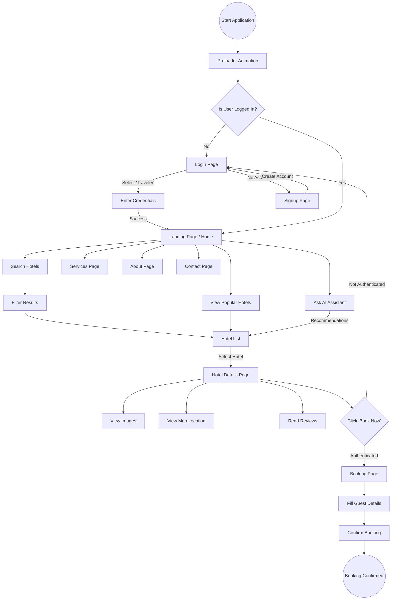

# Traveler User Flow

This flowchart illustrates the journey of a "Traveler" user within the Hotel Booking Application.

## Flow Description

1.  **Initial Access**: When the user opens the application, they are greeted by a Preloader animation.
2.  **Authentication**:
    *   By default, the app redirects to the **Login Page** after loading.
    *   The user selects "Traveler" and logs in.
    *   New users can navigate to the **Signup Page** to create an account.
3.  **Home / Landing Page**:
    *   Once logged in, the traveler lands on the Home page.
    *   Here they can search for hotels, view popular picks, or interact with the **AI Assistant**.
4.  **Discovery**:
    *   Users can use the **Search** feature to find specific hotels.
    *   The **AI Assistant** can also suggest hotels based on preferences.
5.  **Hotel Details**:
    *   Clicking on a hotel takes the user to the **Hotel Details Page**.
    *   Users can view amenities, photos, reviews, and the hotel's location on a map.
6.  **Booking**:
    *   The "Book Now" button initiates the booking process.
    *   This leads to the **Booking Page** (a protected route).
    *   The user fills in their details and confirms the booking.
