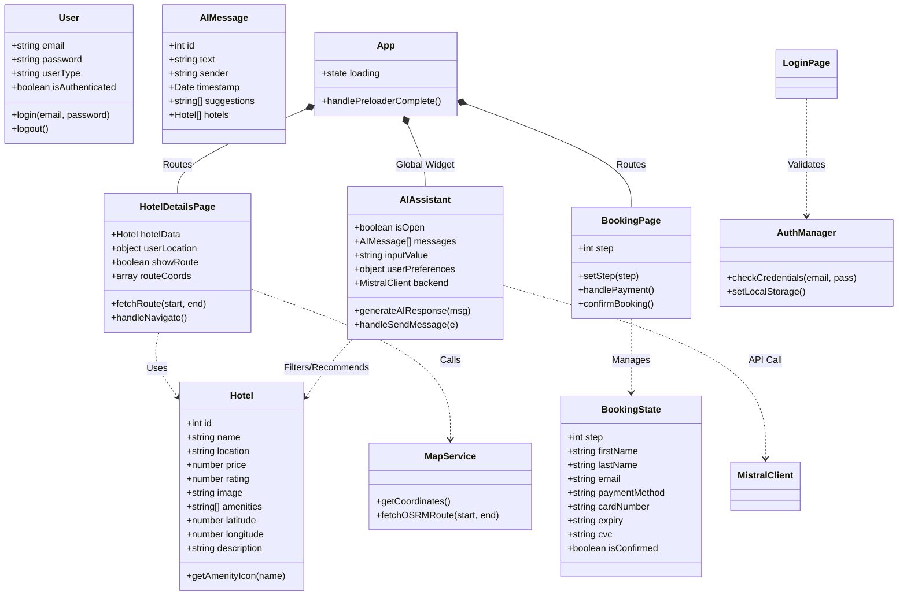
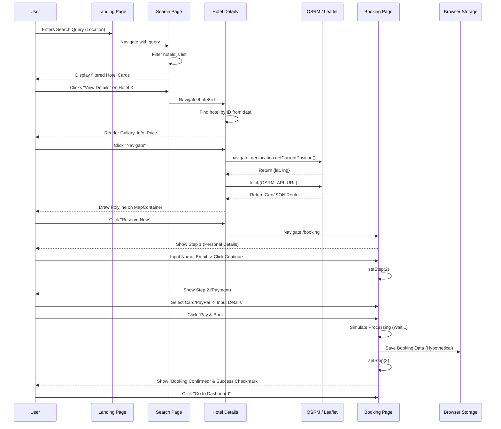
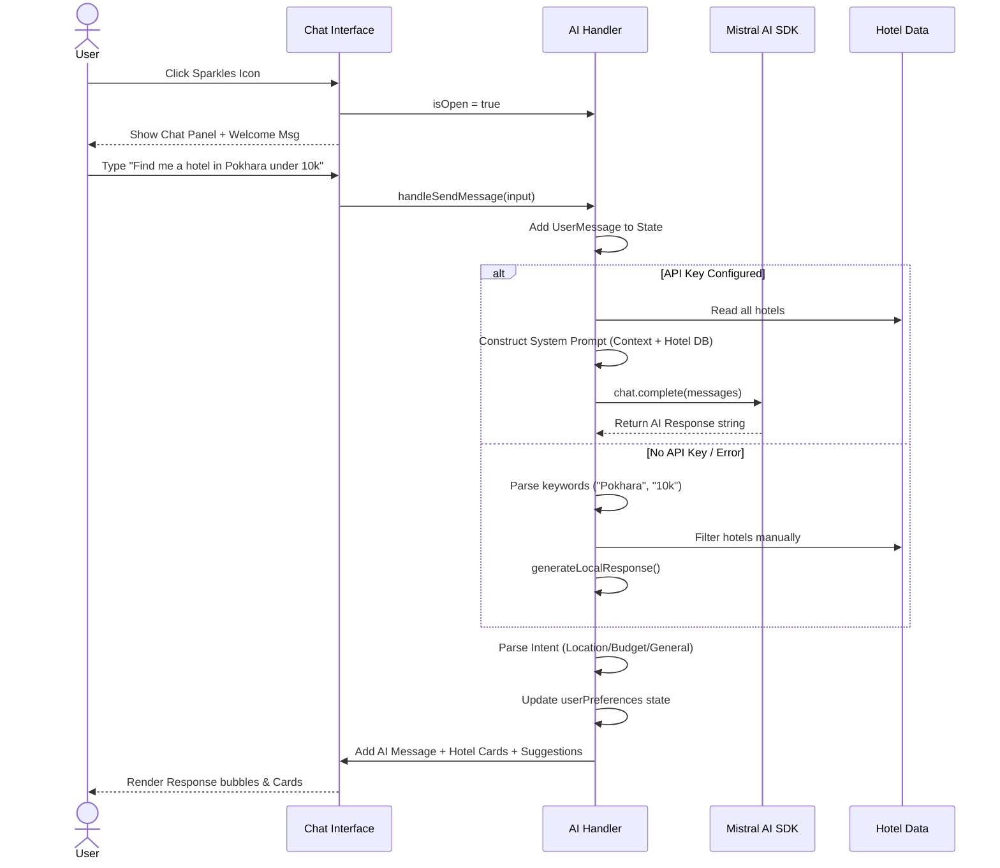
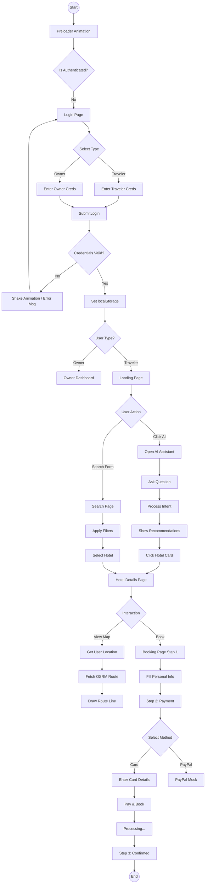

# Detailed UML Diagrams for Hotel Booking System

This document contains comprehensive UML diagrams representing the exact architecture, data flows, and logic of the Hotel Booking Application.

---

## 1. Class Diagram (Component & Data Structure)
**Description**: This diagram represents the React Component hierarchy acting as classes, along with the data interfaces used in the application.



---

## 2. Sequence Diagram: Hotel Search to Booking
**Description**: Detailed interaction flow for a user searching for a hotel, viewing details, calculating a route, and completing a booking.



---

## 3. Sequence Diagram: AI Assistant Interaction
**Description**: Shows the internal logic of the AI Assistant, including local fallbacks and API calls.



---

## 4. Activity Diagram: Detailed User Journey
**Description**: Covers the complete decision-making process for a traveler using the app.



---

## 5. Use Case Diagram (Detailed)
**Description**: Maps all user interactions to specific actors.

```mermaid
usecaseDiagram
    actor "Guest User" as Guest
    actor "Registered Traveler" as Traveler
    actor "Hotel Owner" as Owner
    actor "AI Service" as AI

    package "Front Office" {
        usecase "Browse Search Results" as UC1
        usecase "View Hotel Details" as UC2
        usecase "Interact with Map" as UC3
        usecase "Chat with AI Assistant" as UC4
        usecase "Register/Login" as UC5
    }

    package "Booking System" {
        usecase "Select Dates & Guests" as UC6
        usecase "Enter Payment Details" as UC7
        usecase "Receive Confirmation" as UC8
        usecase "View Booking History" as UC9
    }

    package "Back Office (Owner)" {
        usecase "View Dashboard" as UC10
        usecase "Manage Properties" as UC11
        usecase "Track Revenue" as UC12
    }

    %% Relationships
    Guest --> UC1
    Guest --> UC2
    Guest --> UC3
    Guest --> UC4
    Guest --> UC5

    Traveler --> UC1
    Traveler --> UC2
    Traveler --> UC3
    Traveler --> UC4
    Traveler --> UC6
    Traveler --> UC7
    Traveler --> UC8
    Traveler --> UC9

    Owner --> UC5
    Owner --> UC10
    Owner --> UC11
    Owner --> UC12

    UC4 ..> AI : Connects to
    UC3 ..> "OSRM API" : Fetches Route
```
